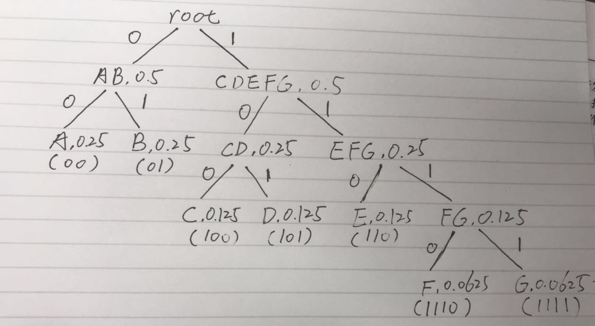

# Huffman Code
```console
$ ./a.out < test.in 
-------input------------
A 0.25
B 0.25
C 0.125
D 0.125
E 0.125
F 0.0625
G 0.0625
-------output------------
A 00
B 01
C 100
D 101
E 110
F 1110
G 1111
```

Bonus 1:
 <br>

Bonus 2:
```console
$ ./a.out < General_Purpose.in 
----------input------------
any             0.059000
a               0.059000
he              0.118000
if              0.118000
woodchuck       0.412000
and             0.294000
much            0.235000
Woods           0.294000
chuck           0.412000
could           0.353000
how             0.059000
If              0.059000
Chuck           0.294000
as              0.235000
wood            0.353000
would           0.412000
How             0.059000
----------output------------
wood            000
woodchuck       001
chuck           010
would           011
much            1000
as              1001
if              10100
any             101010
a               101011
and             1011
Woods           1100
Chuck           1101
how             111000
If              111001
How             111010
he              111011
could           1111
```


