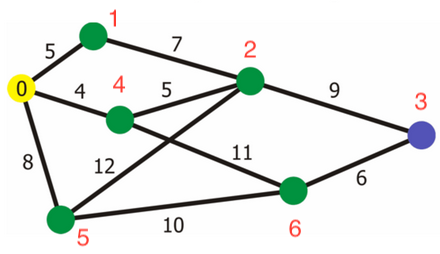

# Dijkstra



Distance:

| 0 | 1 | 2 | 3 | 4 | 5 | 6 |
| :-----:| :------: | :------: | :------: | :------: | :------: | :------: |
| 0 | 5 | 9 | 18 | 4 | 8 | 15 |

Predecessor(-1 for root vertex):

| 0 | 1 | 2 | 3 | 4 | 5 | 6 |
| :-----:| :------: | :------: | :------: | :------: | :------: | :------: |
| -1 | 0 | 4 | 2 | 0 | 0 | 4 |

```console
$ ./Dijsktra < test.in 

0   5   100 100 4   8   100
AddEdge(0, 1, 5)
AddEdge(0, 4, 4)
AddEdge(0, 5, 8)
5   0   7   100 100 100 100
AddEdge(1, 0, 5)
AddEdge(1, 2, 7)
100 7   0   9   5   12  100
AddEdge(2, 1, 7)
AddEdge(2, 3, 9)
AddEdge(2, 4, 5)
AddEdge(2, 5, 12)
100 100 9   0   100 100 6
AddEdge(3, 2, 9)
AddEdge(3, 6, 6)
4   100 5   100 0   100 11
AddEdge(4, 0, 4)
AddEdge(4, 2, 5)
AddEdge(4, 6, 11)
8   100 12  100 100 0   10
AddEdge(5, 0, 8)
AddEdge(5, 2, 12)
AddEdge(5, 6, 10)
100 100 100 6   11  10  0
AddEdge(6, 3, 6)
AddEdge(6, 4, 11)
AddEdge(6, 5, 10)
*********************************

includeing vertex: 1

print predecessor:
   0   1   2   3   4   5   6
  -1   0  -1  -1  -1  -1  -1

print distance:
   0   1   2   3   4   5   6
   0   5 100 100 100 100 100
*********************************

includeing vertex: 4

print predecessor:
   0   1   2   3   4   5   6
  -1   0  -1  -1   0  -1  -1

print distance:
   0   1   2   3   4   5   6
   0   5 100 100   4 100 100
*********************************

includeing vertex: 5

print predecessor:
   0   1   2   3   4   5   6
  -1   0  -1  -1   0   0  -1

print distance:
   0   1   2   3   4   5   6
   0   5 100 100   4   8 100
*********************************

includeing vertex: 2

print predecessor:
   0   1   2   3   4   5   6
  -1   0   4  -1   0   0  -1

print distance:
   0   1   2   3   4   5   6
   0   5   9 100   4   8 100
*********************************

includeing vertex: 6

print predecessor:
   0   1   2   3   4   5   6
  -1   0   4  -1   0   0   4

print distance:
   0   1   2   3   4   5   6
   0   5   9 100   4   8  15
*********************************

includeing vertex: 3

print predecessor:
   0   1   2   3   4   5   6
  -1   0   4   2   0   0   4

print distance:
   0   1   2   3   4   5   6
   0   5   9  18   4   8  15
*********************************

final res:

print predecessor:
   0   1   2   3   4   5   6
  -1   0   4   2   0   0   4

print distance:
   0   1   2   3   4   5   6
   0   5   9  18   4   8  15
*********************************


Process finished with exit code 0
```

