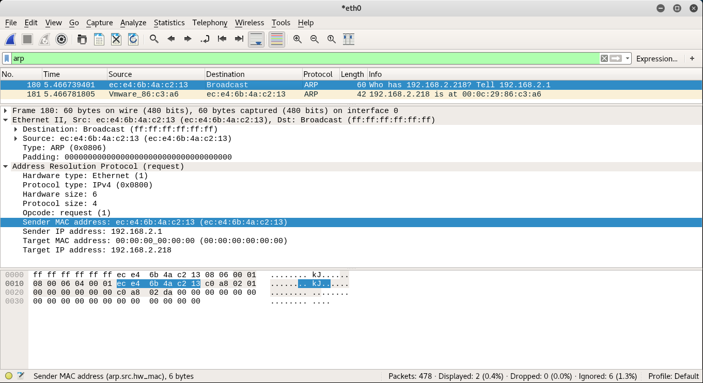
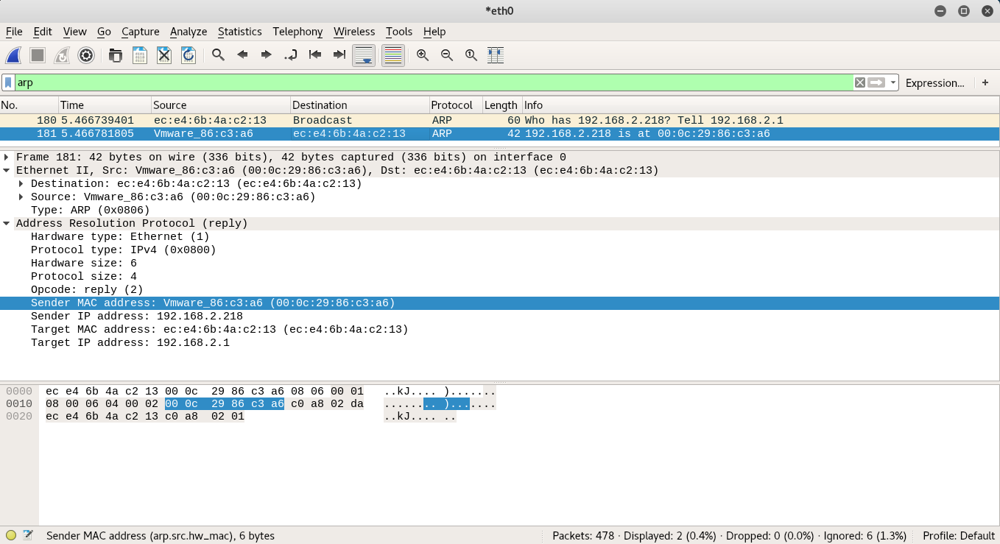

# 

### 資工三A   &emsp;&emsp;&emsp;&emsp;&emsp;&emsp;&emsp;&emsp;李逸鳴 &emsp;&emsp;&emsp;&emsp;&emsp;&emsp;&emsp;&emsp;410419093

***

* Part I: ARP request message
	* a. the hardware type.
    		
    			Hardware type: Ethernet (1)
    	* b. the protocol type.
    		
    			Protocol type: IPv4 (0x0800)
    	* c. the hardware length.
    		
    			Hardware size: 6
    	* d. the protocol length.
    				
    			Protocol size: 4
    	* e. the operation code.
    		
    			Opcode: request (1)
    	* f. the source hardware address.
    		
    			Sender MAC address: ec:e4:6b:4a:c2:13
    	* g. the source protocol address?
    		
    			Sender IP address: 192.168.2.1
    	* h. the destination hardware address.		
    	
    			Target MAC address: Broadcast(ff:ff:ff:ff:ff:ff)
    			
    	* i. the destination protocol address?		
    
    			Target IP address: 192.168.2.218
	
	
***

* Part II: ARP reply message
* a. the hardware type.
		
			Hardware type: Ethernet (1)
	* b. the protocol type.
		
			Protocol type: IPv4 (0x0800)
	* c. the hardware length.
		
			Hardware size: 6
	* d. the protocol length.
				
			Protocol size: 4
	* e. the operation code.
		
			Opcode: request (1)
	* f. the source hardware address.
		
			Sender MAC address: Vmware_86:c3:a6 (00:0c:29:86:c3:c6)
	* g. the source protocol address?
		
			Sender IP address: 192.168.2.218
	* h. the destination hardware address.		
	
			Target MAC address: ec:e4:6b:4a:c2:13
			
	* i. the destination protocol address?		

			Target IP address: 192.168.2.1
	