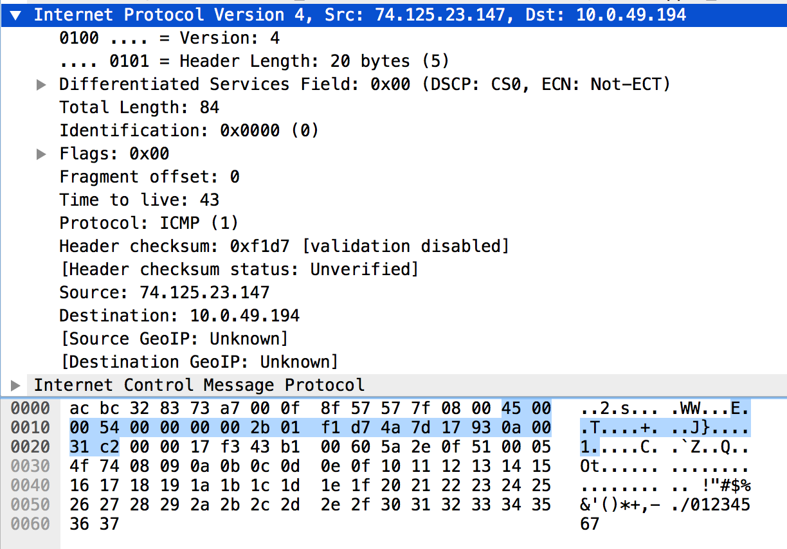

# 

### 資工三A   &emsp;&emsp;&emsp;&emsp;&emsp;&emsp;&emsp;&emsp;李逸鳴 &emsp;&emsp;&emsp;&emsp;&emsp;&emsp;&emsp;&emsp;410419093

***

- Version: 4
    + IP protocol version 
- Header Length: 5 (20 bytes)
    + total_length: 5x4=20 bytes
- Differentiated Services Field: 0x00
    + default
- Total Length: 0x54 (84 bytes)
    + data lenght=total_length - header_length
- Identification: 0x0000
- Flags: 0x00
- Fragment offset: 0
- Time to live: 2b (43)
- Protocol: 01 (01, ICMP)
- Header checksum: 0xf1d7
- Source: 0x4a7d1793 = 74.125.23.147
- Destination: 0x0a0031c2 = 10.0.49.194